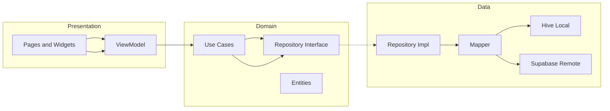
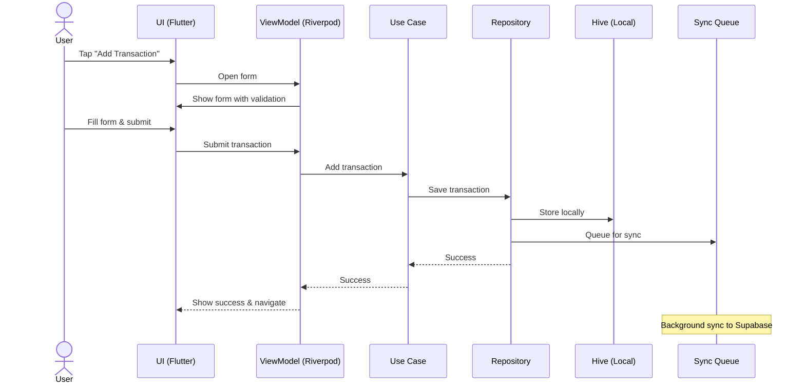

<div align="center">

# 💸 Pocketa

Personal finance for everyone — built with Flutter, Riverpod, and Clean Architecture. Offline‑first with Hive; designed to sync with Supabase.

[](https://flutter.dev)
[](https://riverpod.dev)
[](https://hivedb.dev)
[](LICENSE)

</div>

---

## 🚀 Features (MVP Scope)

- **Authentication & Onboarding**
  - Email/Password, Google, Apple (via Supabase Auth)
  - Collects: Name, Income Source/Range, Language (bn/en), Currency (৳)
  - Modern, responsive onboarding flow with progress tracking

- **Expense Management**
  - CRUD for transactions (income / expense / transfer)
  - Manual wallets: Cash, bKash, Nagad, Bank
  - Offline‑first (Hive cache) → syncs to Supabase when online
  - Smart transaction forms with validation

- **Categories & Budgeting**
  - Predefined categories (Food, Rent, Transport, …)
  - Custom categories with icon support
  - Monthly budgets per category + overspend alerts

- **Dashboard (Insights)**
  - Monthly summary: income vs expense
  - Category pie chart, daily/weekly trend line chart
  - Charts wired to dummy providers first, real repos later

- **Localization**
  - Bangla 🇧🇩 / English 🌐 toggle
  - Local date format: `dd‑MM‑yyyy`, default currency: `BDT (৳)`

- **Retention & Gamification**
  - Streaks: consecutive days logging ≥ 1 transaction
  - Badges: e.g., 7‑day streak, 30 transactions logged
  - Lightweight banners & nudges

- **Performance & Quality**
  - Comprehensive error handling and monitoring
  - Memory-optimized widgets with proper disposal
  - Performance monitoring and analytics
  - Extensive test coverage

---

## 🏛️ Clean Architecture Overview



---

## 📂 Project Structure

```
lib/
├── main.dart                 # App entrypoint
├── app.dart                  # Root MaterialApp / theme / routing
├── core/                     # Cross-cutting concerns
│   ├── routing/              # GoRouter setup
│   ├── theme/                # Theme, color schemes
│   ├── utils/                # Helpers (currency, datetime, etc.)
│   ├── errors/               # Error & failure classes
│   ├── enums/                # Shared enums
│   ├── result/               # Result/Either helpers
│   ├── error_handling/       # Centralized error handling
│   └── performance/          # Performance monitoring
├── shared/widgets/           # Generic reusable UI
│   ├── input/                # AppTextField, AppAmountField, etc.
│   ├── custom_silver_app_bar.dart
│   ├── summary_header.dart
│   ├── performance_optimized_widget.dart
│   └── custom_snackbar.dart
├── shared/services/          # Shared services
│   └── snackbar_service.dart
├── features/
│   ├── transaction/
│   │   ├── presentation/
│   │   │   ├── pages/        # Add/Edit screen, List screen
│   │   │   ├── widgets/      # Reusable transaction widgets
│   │   │   │   └── transaction_form/  # Form components
│   │   │   └── viewmodels/   # Riverpod states & notifiers
│   │   ├── domain/
│   │   │   ├── entities/     # TransactionEntity
│   │   │   ├── repositories/ # Abstract TransactionRepository
│   │   │   └── usecases/     # Add, Delete, GetSummary, etc.
│   │   └── data/
│   │       ├── models/       # Hive DTOs
│   │       └── repositories/ # TransactionRepoImpl
│   ├── dashboard/
│   │   └── presentation/pages/
│   ├── onboarding/
│   │   └── presentation/pages/
│   ├── wallets/
│   └── categories/
└── test/                     # Comprehensive test suite
    ├── features/             # Feature-specific tests
    ├── core/                 # Core functionality tests
    └── integration/          # Integration tests
```

Barrel files simplify imports:

- `features/transaction/domain/domain.dart`
- `features/transaction/data/data.dart`
- `features/transaction/presentation/pages/pages.dart`
- `features/transaction/presentation/viewmodels/viewmodels.dart`
- `shared/widgets/widgets.dart` (includes `shared/widgets/input/input.dart`)

---

## 🔁 Flow Example (Add Transaction)



---

## 🛠️ Development Setup

### Prerequisites

- Flutter SDK (>=3.6.0)
- Dart SDK (>=3.6.0)
- Android Studio / VS Code
- Git

### Installation

1. **Clone the repository**
   ```bash
   git clone https://github.com/rakibulmehedi/Pocketa-V2.git
   cd pocketa
   ```

2. **Install dependencies**
   ```bash
   flutter pub get
   ```

3. **Generate code**
   ```bash
   flutter packages pub run build_runner build
   ```

4. **Generate localizations**
   ```bash
   flutter gen-l10n
   ```

5. **Run the app**
   ```bash
   flutter run
   ```

### Development Commands

```bash
# Run tests
flutter test

# Run tests with coverage
flutter test --coverage

# Analyze code
flutter analyze

# Format code
dart format .

# Build for release
flutter build apk --release
flutter build ios --release

# Clean build
flutter clean && flutter pub get
```

---

## 🧪 Testing

The project includes comprehensive testing at multiple levels:

### Unit Tests
- **Core functionality**: Error handling, performance monitoring, utilities
- **Business logic**: Use cases, repositories, state management
- **Widget tests**: Individual widget behavior and interactions

### Integration Tests
- **User flows**: Complete user journeys through the app
- **Data persistence**: Hive database operations
- **Navigation**: Route transitions and deep linking

### Test Structure
```
test/
├── core/
│   ├── error_handling/       # Error handling tests
│   ├── performance/          # Performance monitoring tests
│   └── utils/                # Utility function tests
├── features/
│   ├── transaction/          # Transaction feature tests
│   ├── onboarding/           # Onboarding flow tests
│   └── wallets/              # Wallet management tests
└── integration/              # End-to-end tests
```

### Running Tests
```bash
# Run all tests
flutter test

# Run specific test file
flutter test test/features/transaction/presentation/widgets/transaction_amount_section_test.dart

# Run tests with coverage
flutter test --coverage
genhtml coverage/lcov.info -o coverage/html
open coverage/html/index.html
```

---

## 🚀 Performance Optimizations

### Memory Management
- **Automatic disposal**: `PerformanceOptimizedWidget` base class
- **Resource cleanup**: Proper disposal of controllers and animations
- **Memory monitoring**: Track memory usage and leaks

### State Management
- **Selective rebuilds**: Use `.select()` for targeted updates
- **Provider optimization**: Minimize unnecessary provider rebuilds
- **State persistence**: Efficient state serialization

### UI Performance
- **Widget splitting**: Large widgets broken into smaller components
- **Lazy loading**: Load data only when needed
- **Animation optimization**: Smooth 60fps animations

### Performance Monitoring
```dart
// Measure performance
PerformanceMonitor.measure('database_query', () {
  // Database operation
});

// Monitor widget builds
class MyWidget extends PerformanceMeasuredWidget {
  // Widget implementation
}
```

---

## 🔧 Error Handling

### Centralized Error Management
- **Global error handler**: Catch and handle all uncaught errors
- **User-friendly messages**: Convert technical errors to user messages
- **Retry mechanisms**: Automatic retry for transient failures
- **Error reporting**: Log errors for debugging and monitoring

### Error Types
- **Cache errors**: Local storage issues
- **Database errors**: Hive database problems
- **Network errors**: Connectivity and API issues
- **Validation errors**: Input validation failures
- **Unknown errors**: Unexpected system errors

### Usage
```dart
// Handle errors in widgets
class MyWidget extends StatefulWidget with ErrorHandlingMixin {
  void _handleError() {
    handleError(
      const Failure.network(),
      message: 'Failed to load data',
      onRetry: () => _loadData(),
    );
  }
}

// Handle async operations
final result = await handleAsync(
  () => _loadData(),
  errorMessage: 'Failed to load data',
  onRetry: () => _loadData(),
);
```

---

## 📱 Responsive Design

### Breakpoints
- **Mobile**: < 600px
- **Tablet**: 600px - 1024px
- **Desktop**: > 1024px

### Implementation
```dart
// Use responsive layout
final layout = context.layout;

// Responsive spacing
SizedBox(height: layout.spaceM);

// Responsive text
Text(
  'Hello',
  style: TextStyle(fontSize: layout.tLg),
);

// Responsive dimensions
Container(
  width: 200.ic(context),
  height: 100.ic(context),
);
```

---

## 🌐 Internationalization

### Supported Languages
- **English** (en): Default language
- **Bengali** (bn): Primary target language

### Adding New Translations
1. Add keys to `lib/l10n/app_en.arb`
2. Add translations to `lib/l10n/app_bn.arb`
3. Run `flutter gen-l10n`
4. Use in code: `AppLocalizations.of(context).keyName`

### Usage
```dart
// Get localized text
final l10n = AppLocalizations.of(context);
Text(l10n.welcomeMessage);

// Pluralization
Text(l10n.itemCount(count));

// Date formatting
Text(l10n.formatDate(DateTime.now()));
```

---

## 🔐 Security

### Data Protection
- **Local encryption**: Sensitive data encrypted in Hive
- **Secure storage**: Use Flutter secure storage for tokens
- **Input validation**: Sanitize all user inputs
- **Error sanitization**: Don't expose sensitive data in errors

### Best Practices
- **No hardcoded secrets**: Use environment variables
- **Secure communication**: HTTPS only for API calls
- **Data minimization**: Store only necessary data
- **Regular updates**: Keep dependencies updated

---

## 📊 Analytics & Monitoring

### Performance Metrics
- **App startup time**: Track cold and warm startup
- **Screen load times**: Monitor screen transition performance
- **Database operations**: Track query performance
- **Memory usage**: Monitor memory consumption

### User Analytics
- **Feature usage**: Track which features are used most
- **User flows**: Monitor user journey through the app
- **Error rates**: Track and analyze error occurrences
- **Performance issues**: Identify and fix performance bottlenecks

---

## 🚀 Deployment

### Android
```bash
# Build APK
flutter build apk --release

# Build App Bundle
flutter build appbundle --release

# Install on device
flutter install
```

### iOS
```bash
# Build for iOS
flutter build ios --release

# Archive for App Store
# Use Xcode for archiving and uploading
```

### Web
```bash
# Build for web
flutter build web --release

# Serve locally
flutter run -d web-server --web-port 8080
```

---

## 🤝 Contributing

### Development Workflow
1. Fork the repository
2. Create a feature branch: `git checkout -b feature/amazing-feature`
3. Make your changes
4. Add tests for new functionality
5. Run tests: `flutter test`
6. Commit changes: `git commit -m 'Add amazing feature'`
7. Push to branch: `git push origin feature/amazing-feature`
8. Open a Pull Request

### Code Style
- Follow Flutter/Dart style guidelines
- Use meaningful variable and function names
- Add comments for complex logic
- Write tests for new features
- Update documentation as needed

### Pull Request Guidelines
- Clear description of changes
- Link to related issues
- Include screenshots for UI changes
- Ensure all tests pass
- Update documentation if needed

---

## 📄 License

This project is licensed under the MIT License - see the [LICENSE](LICENSE) file for details.

---

## 🙏 Acknowledgments

- **Flutter Team** for the amazing framework
- **Riverpod Team** for excellent state management
- **Hive Team** for the lightweight database
- **Community** for feedback and contributions

---

## 📞 Support

- **Issues**: [GitHub Issues](https://github.com/rakibulmehedi/Pocketa-V2/issues)
- **Discussions**: [GitHub Discussions](https://github.com/rakibulmehedi/Pocketa-V2/discussions)
- **Email**: support@pocketa.app

---

<div align="center">

**Made with ❤️ by the Pocketa Team**

[⭐ Star this repo](https://github.com/rakibulmehedi/Pocketa-V2) • [🐛 Report Bug](https://github.com/rakibulmehedi/Pocketa-V2/issues) • [💡 Request Feature](https://github.com/rakibulmehedi/Pocketa-V2/issues)

</div>