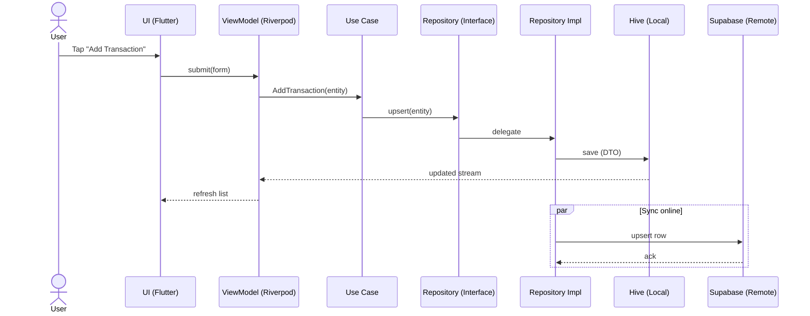
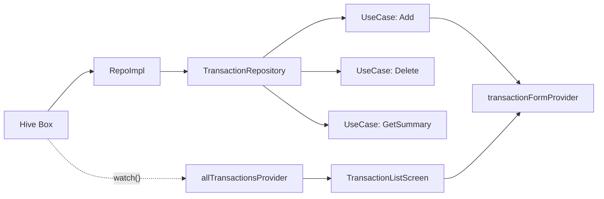

<div align="center">

# 💸 Pocketa

Personal finance for everyone — built with Flutter, Riverpod, and Clean Architecture. Offline‑first with Hive; designed to sync with Supabase.

</div>

---

## 🚀 Features (MVP Scope)

- Authentication & Onboarding
  - Email/Password, Google, Apple (via Supabase Auth)
  - Collects: Name, Income Source/Range, Language (bn/en), Currency (৳)
- Expense Management
  - CRUD for transactions (income / expense / transfer)
  - Manual wallets: Cash, bKash, Nagad, Bank
  - Offline‑first (Hive cache) → syncs to Supabase when online
- Categories & Budgeting
  - Predefined categories (Food, Rent, Transport, …)
  - Custom categories with icon support
  - Monthly budgets per category + overspend alerts
- Dashboard (Insights)
  - Monthly summary: income vs expense
  - Category pie chart, daily/weekly trend line chart
  - Charts wired to dummy providers first, real repos later
- Localization
  - Bangla 🇧🇩 / English 🌐 toggle
  - Local date format: `dd‑MM‑yyyy`, default currency: `BDT (৳)`
- Retention & Gamification
  - Streaks: consecutive days logging ≥ 1 transaction
  - Badges: e.g., 7‑day streak, 30 transactions logged
  - Lightweight banners & nudges

---

## 🏛️ Clean Architecture Overview

```mermaid
flowchart LR
  subgraph Presentation[Presentation (MVVM)]
    UI[Pages/Widgets] --> VM[ViewModel (Riverpod Notifier)]
  end

  subgraph Domain[Domain Layer]
    UC[Use Cases] --> RepoIntf[(Repository Interface)]
    Entities[Entities / Value Objects]
  end

  subgraph Data[Data Layer]
    RepoImpl[Repository Impl] --> Mapper[DTO <-> Entity]
    Mapper --> Hive[(Hive Local)]
    Mapper --> Supabase[(Supabase Remote)]
  end

  UI --> VM --> UC --> RepoIntf
  RepoIntf -.implemented by .-> RepoImpl
```

---

## 📂 Project Structure

```
lib/
├── main.dart                 # App entrypoint
├── app.dart                  # Root MaterialApp / theme / routing
├── core/                     # Cross-cutting concerns
│   ├── routing/              # GoRouter setup
│   ├── theme/                # Theme, color schemes
│   ├── utils/                # Helpers (currency, datetime, etc.)
│   ├── errors/               # Error & failure classes
│   ├── enums/                # Shared enums
│   └── result/               # Result/Either helpers
├── shared/widgets/           # Generic reusable UI
│   ├── input/                # AppTextField, AppAmountField, etc.
│   ├── custom_silver_app_bar.dart
│   └── summary_header.dart
├── features/
│   ├── transaction/
│   │   ├── presentation/
│   │   │   ├── pages/        # Add/Edit screen, List screen
│   │   │   └── viewmodels/   # Riverpod states & notifiers
│   │   ├── domain/
│   │   │   ├── entities/     # TransactionEntity
│   │   │   ├── repositories/ # Abstract TransactionRepository
│   │   │   └── usecases/     # Add, Delete, GetSummary, etc.
│   │   └── data/
│   │       ├── models/       # Hive DTOs
│   │       └── repositories/ # TransactionRepoImpl
│   ├── dashboard/
│   │   └── presentation/pages/
│   └── onboarding/
│       └── presentation/pages/
```

Barrel files simplify imports:

- `features/transaction/domain/domain.dart`
- `features/transaction/data/data.dart`
- `features/transaction/presentation/pages/pages.dart`
- `features/transaction/presentation/viewmodels/viewmodels.dart`
- `shared/widgets/widgets.dart` (includes `shared/widgets/input/input.dart`)

---

## 🔁 Flow Example (Add Transaction)



---

## 📦 Providers (Riverpod)



---

## 🧑‍💻 Development

### Requirements

- Flutter 3.22+
- Dart 3.9+
- Hive (local persistence)
- Supabase (backend BaaS)

### Setup

```bash
flutter pub get
flutter pub run build_runner build --delete-conflicting-outputs
```

Initialize Hive boxes and adapters at startup (see `lib/main.dart`):

```dart
await Hive.initFlutter();
Hive.registerAdapter(TransactionTypeAdapter());
Hive.registerAdapter(CategoryAdapter());
Hive.registerAdapter(TransactionAdapter());
await Hive.openBox<Transaction>('transactions');
```

Run the app:

```bash
flutter run
```

---

## 🧪 Testing

- Unit tests for entities, mappers, and use cases
- Golden tests for critical widgets (transaction tile, summary header)
- Integration tests (auth + CRUD flow with Supabase)

---

## 🏅 Gamification Logic (MVP)

- Increment streak on first transaction of the day
- Break streak if no tx for > 1 day
- Award badges:
  - `FIRST_7_STREAK` → after 7‑day streak
  - `LOG_30_TRANSACTIONS` → after 30 tx logged
- Show banner/toast, non‑intrusive

---

## 📊 Roadmap (Next Phases)

- Wallet auto‑import (SMS parsing, bKash/Nagad APIs)
- Shared household budgets
- AI insights: auto‑categorize & budget recommend
- Multi‑currency support
- Export to Excel / Google Sheets

---

## ✨ Screenshots (Sample)

Add app screenshots here when ready — Dashboard, Add/Edit Tx, Onboarding.

---

## 👤 Author

**Rakibul Islam Mehedi**  
Flutter Developer & Tech Entrepreneur  
Building Pocketa to help users in Bangladesh manage money with better awareness & habits.

