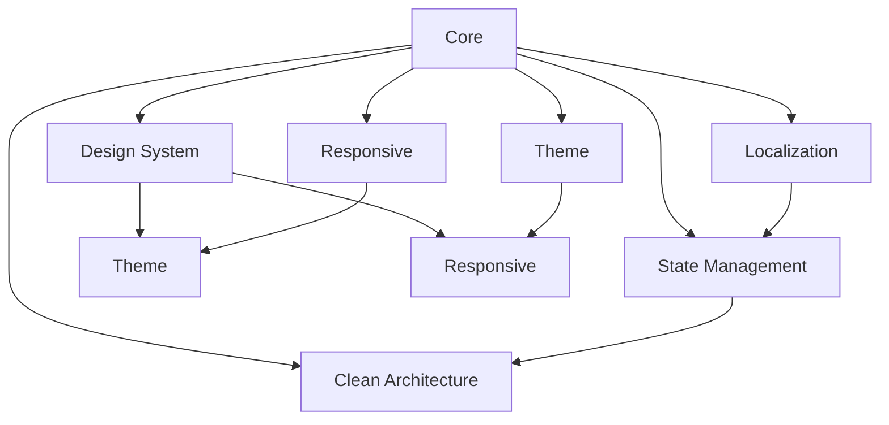

# Reusable Package Extraction Guide
## PocketA - Creating Reusable System Packages

---

## 📋 Table of Contents

1. [Overview](#overview)
2. [Package Strategy](#package-strategy)
3. [Design System Package](#design-system-package)
4. [Responsive System Package](#responsive-system-package)
5. [Theme System Package](#theme-system-package)
6. [Localization Package](#localization-package)
7. [State Management Package](#state-management-package)
8. [Clean Architecture Package](#clean-architecture-package)
9. [Package Publishing](#package-publishing)
10. [Multi-Package Management](#multi-package-management)
11. [Version Management](#version-management)
12. [Documentation Strategy](#documentation-strategy)

---

## 🎯 Overview

This guide provides comprehensive instructions for extracting PocketA's centralized systems into reusable packages that can be shared across multiple projects. Each package is designed to be independent, well-documented, and easy to integrate.

### Package Benefits
- **Reusability**: Share systems across multiple projects
- **Consistency**: Maintain design and architectural consistency
- **Maintainability**: Centralized updates and bug fixes
- **Scalability**: Easy to add new features and improvements
- **Team Collaboration**: Standardized development practices
- **Version Control**: Independent versioning and release cycles

---

## 📦 Package Strategy

### Package Architecture

```
pocketa-packages/
├── packages/
│   ├── design_system/           # UI components and tokens
│   ├── responsive/              # Responsive utilities
│   ├── theme/                   # Theme management
│   ├── localization/            # i18n system
│   ├── state_management/        # Riverpod patterns
│   ├── clean_architecture/      # Architecture patterns
│   └── core/                    # Shared utilities
├── examples/
│   ├── design_system_demo/      # Design system showcase
│   ├── responsive_demo/         # Responsive examples
│   └── full_app_demo/           # Complete app example
├── docs/                        # Shared documentation
├── scripts/                     # Build and publish scripts
└── README.md
```

### Package Dependencies



---

## 🎨 Design System Package

### Package Structure

```
pocketa_design_system/
├── lib/
│   ├── pocketa_design_system.dart
│   ├── tokens/
│   │   ├── design_tokens.dart
│   │   ├── color_tokens.dart
│   │   ├── typography_tokens.dart
│   │   └── component_tokens.dart
│   ├── components/
│   │   ├── buttons/
│   │   ├── cards/
│   │   ├── inputs/
│   │   ├── navigation/
│   │   └── feedback/
│   ├── themes/
│   │   ├── light_theme.dart
│   │   ├── dark_theme.dart
│   │   └── theme_extensions.dart
│   └── utils/
│       ├── responsive_helpers.dart
│       └── color_helpers.dart
├── assets/
│   ├── fonts/
│   └── icons/
├── test/
├── example/
└── pubspec.yaml
```

### Package pubspec.yaml

```yaml
name: pocketa_design_system
description: PocketA Design System - Comprehensive UI components and design tokens
version: 1.0.0

environment:
  sdk: '>=3.0.0 <4.0.0'
  flutter: ">=3.10.0"

dependencies:
  flutter:
    sdk: flutter
  flutter_riverpod: ^2.4.0
  google_fonts: ^6.1.0
  responsive_framework: ^1.1.1

dev_dependencies:
  flutter_test:
    sdk: flutter
  flutter_lints: ^3.0.0
  build_runner: ^2.4.7

flutter:
  uses-material-design: true
  assets:
    - assets/fonts/
    - assets/icons/
  fonts:
    - family: Inter
      fonts:
        - asset: assets/fonts/inter/Inter-Regular.ttf
        - asset: assets/fonts/inter/Inter-Medium.ttf
          weight: 500
        - asset: assets/fonts/inter/Inter-SemiBold.ttf
          weight: 600
        - asset: assets/fonts/inter/Inter-Bold.ttf
          weight: 700
```

### Main Export File

```dart
// lib/pocketa_design_system.dart
library pocketa_design_system;

// Design Tokens
export 'tokens/design_tokens.dart';
export 'tokens/color_tokens.dart';
export 'tokens/typography_tokens.dart';
export 'tokens/component_tokens.dart';

// Components
export 'components/buttons/pocketa_button.dart';
export 'components/buttons/pocketa_icon_button.dart';
export 'components/cards/pocketa_card.dart';
export 'components/inputs/pocketa_text_field.dart';
export 'components/navigation/pocketa_bottom_nav.dart';
export 'components/feedback/pocketa_snackbar.dart';

// Themes
export 'themes/light_theme.dart';
export 'themes/dark_theme.dart';
export 'themes/theme_extensions.dart';

// Utils
export 'utils/responsive_helpers.dart';
export 'utils/color_helpers.dart';
```

### Component Example

```dart
// lib/components/buttons/pocketa_button.dart
import 'package:flutter/material.dart';
import 'package:pocketa_design_system/tokens/design_tokens.dart';
import 'package:pocketa_design_system/tokens/color_tokens.dart';

class PocketaButton extends StatelessWidget {
  final String text;
  final VoidCallback? onPressed;
  final PocketaButtonStyle style;
  final PocketaButtonSize size;
  final bool isLoading;
  final Widget? icon;
  
  const PocketaButton({
    super.key,
    required this.text,
    this.onPressed,
    this.style = PocketaButtonStyle.primary,
    this.size = PocketaButtonSize.medium,
    this.isLoading = false,
    this.icon,
  });
  
  @override
  Widget build(BuildContext context) {
    final tokens = DesignTokens.of(context);
    final colors = ColorTokens.of(context);
    
    return ElevatedButton(
      onPressed: isLoading ? null : onPressed,
      style: _getButtonStyle(context, tokens, colors),
      child: _buildButtonContent(tokens),
    );
  }
  
  ButtonStyle _getButtonStyle(
    BuildContext context,
    DesignTokens tokens,
    ColorTokens colors,
  ) {
    return ElevatedButton.styleFrom(
      backgroundColor: _getBackgroundColor(colors),
      foregroundColor: _getForegroundColor(colors),
      elevation: tokens.elevation.medium,
      padding: _getPadding(tokens),
      shape: RoundedRectangleBorder(
        borderRadius: BorderRadius.circular(tokens.borderRadius.medium),
      ),
    );
  }
  
  Widget _buildButtonContent(DesignTokens tokens) {
    if (isLoading) {
      return SizedBox(
        width: tokens.spacing.medium,
        height: tokens.spacing.medium,
        child: const CircularProgressIndicator(strokeWidth: 2),
      );
    }
    
    if (icon != null) {
      return Row(
        mainAxisSize: MainAxisSize.min,
        children: [
          icon!,
          SizedBox(width: tokens.spacing.small),
          Text(text),
        ],
      );
    }
    
    return Text(text);
  }
}

enum PocketaButtonStyle { primary, secondary, text, icon }
enum PocketaButtonSize { small, medium, large }
```

---

## 📱 Responsive System Package

### Package Structure

```
pocketa_responsive/
├── lib/
│   ├── pocketa_responsive.dart
│   ├── breakpoints/
│   │   ├── app_breakpoint.dart
│   │   └── device_size.dart
│   ├── widgets/
│   │   ├── responsive_builder.dart
│   │   ├── responsive_widget.dart
│   │   └── responsive_scaffold.dart
│   ├── utils/
│   │   ├── responsive_helpers.dart
│   │   ├── screen_utils.dart
│   │   └── layout_helpers.dart
│   └── extensions/
│       ├── context_extensions.dart
│       └── widget_extensions.dart
├── test/
├── example/
└── pubspec.yaml
```

### Package pubspec.yaml

```yaml
name: pocketa_responsive
description: PocketA Responsive System - Responsive utilities and widgets
version: 1.0.0

environment:
  sdk: '>=3.0.0 <4.0.0'
  flutter: ">=3.10.0"

dependencies:
  flutter:
    sdk: flutter

dev_dependencies:
  flutter_test:
    sdk: flutter
  flutter_lints: ^3.0.0
```

### Main Export File

```dart
// lib/pocketa_responsive.dart
library pocketa_responsive;

// Breakpoints
export 'breakpoints/app_breakpoint.dart';
export 'breakpoints/device_size.dart';

// Widgets
export 'widgets/responsive_builder.dart';
export 'widgets/responsive_widget.dart';
export 'widgets/responsive_scaffold.dart';

// Utils
export 'utils/responsive_helpers.dart';
export 'utils/screen_utils.dart';
export 'utils/layout_helpers.dart';

// Extensions
export 'extensions/context_extensions.dart';
export 'extensions/widget_extensions.dart';
```

### Responsive Widget Example

```dart
// lib/widgets/responsive_widget.dart
import 'package:flutter/material.dart';
import 'package:pocketa_responsive/breakpoints/app_breakpoint.dart';
import 'package:pocketa_responsive/utils/responsive_helpers.dart';

class ResponsiveWidget extends StatelessWidget {
  final Widget mobile;
  final Widget? tablet;
  final Widget? desktop;
  final Widget? fallback;
  
  const ResponsiveWidget({
    super.key,
    required this.mobile,
    this.tablet,
    this.desktop,
    this.fallback,
  });
  
  @override
  Widget build(BuildContext context) {
    return ResponsiveBuilder(
      builder: (context, screenSize) {
        switch (screenSize.deviceSize) {
          case DeviceSize.mobile:
            return mobile;
          case DeviceSize.tablet:
            return tablet ?? fallback ?? mobile;
          case DeviceSize.desktop:
            return desktop ?? tablet ?? fallback ?? mobile;
        }
      },
    );
  }
}

// Usage example
class MyResponsivePage extends StatelessWidget {
  @override
  Widget build(BuildContext context) {
    return ResponsiveWidget(
      mobile: MobileLayout(),
      tablet: TabletLayout(),
      desktop: DesktopLayout(),
    );
  }
}
```

---

## 🎨 Theme System Package

### Package Structure

```
pocketa_theme/
├── lib/
│   ├── pocketa_theme.dart
│   ├── themes/
│   │   ├── app_theme.dart
│   │   ├── light_theme.dart
│   │   ├── dark_theme.dart
│   │   └── theme_extensions.dart
│   ├── providers/
│   │   ├── theme_provider.dart
│   │   └── theme_notifier.dart
│   ├── models/
│   │   ├── theme_mode.dart
│   │   └── theme_preferences.dart
│   └── utils/
│       ├── theme_helpers.dart
│       └── color_scheme_utils.dart
├── test/
├── example/
└── pubspec.yaml
```

### Package pubspec.yaml

```yaml
name: pocketa_theme
description: PocketA Theme System - Theme management and customization
version: 1.0.0

environment:
  sdk: '>=3.0.0 <4.0.0'
  flutter: ">=3.10.0"

dependencies:
  flutter:
    sdk: flutter
  flutter_riverpod: ^2.4.0
  shared_preferences: ^2.2.2
  material_color_utilities: ^0.8.0

dev_dependencies:
  flutter_test:
    sdk: flutter
  flutter_lints: ^3.0.0
```

### Theme Provider Example

```dart
// lib/providers/theme_provider.dart
import 'package:flutter/material.dart';
import 'package:flutter_riverpod/flutter_riverpod.dart';
import 'package:pocketa_theme/models/theme_mode.dart';
import 'package:pocketa_theme/providers/theme_notifier.dart';

final themeProvider = StateNotifierProvider<ThemeNotifier, ThemeMode>(
  (ref) => ThemeNotifier(),
);

final currentThemeProvider = Provider<ThemeData>((ref) {
  final themeMode = ref.watch(themeProvider);
  return themeMode == ThemeMode.light 
    ? AppTheme.light 
    : AppTheme.dark;
});

// Usage in app
class MyApp extends ConsumerWidget {
  @override
  Widget build(BuildContext context, WidgetRef ref) {
    final theme = ref.watch(currentThemeProvider);
    
    return MaterialApp(
      theme: theme,
      home: MyHomePage(),
    );
  }
}
```

---

## 🌍 Localization Package

### Package Structure

```
pocketa_localization/
├── lib/
│   ├── pocketa_localization.dart
│   ├── l10n/
│   │   ├── app_localizations.dart
│   │   ├── app_localizations_en.dart
│   │   └── app_localizations_bn.dart
│   ├── providers/
│   │   ├── locale_provider.dart
│   │   └── locale_notifier.dart
│   ├── models/
│   │   ├── supported_locale.dart
│   │   └── locale_preferences.dart
│   └── utils/
│       ├── locale_helpers.dart
│       └── translation_utils.dart
├── assets/
│   └── l10n/
│       ├── app_en.arb
│       └── app_bn.arb
├── test/
├── example/
└── pubspec.yaml
```

### Package pubspec.yaml

```yaml
name: pocketa_localization
description: PocketA Localization System - Internationalization support
version: 1.0.0

environment:
  sdk: '>=3.0.0 <4.0.0'
  flutter: ">=3.10.0"

dependencies:
  flutter:
    sdk: flutter
  flutter_localizations:
    sdk: flutter
  flutter_riverpod: ^2.4.0
  shared_preferences: ^2.2.2

dev_dependencies:
  flutter_test:
    sdk: flutter
  flutter_lints: ^3.0.0

flutter:
  generate: true
```

### Localization Provider Example

```dart
// lib/providers/locale_provider.dart
import 'package:flutter/material.dart';
import 'package:flutter_riverpod/flutter_riverpod.dart';
import 'package:pocketa_localization/providers/locale_notifier.dart';

final localeProvider = StateNotifierProvider<LocaleNotifier, Locale>(
  (ref) => LocaleNotifier(),
);

final appLocalizationsProvider = Provider<AppLocalizations>((ref) {
  final locale = ref.watch(localeProvider);
  return lookupAppLocalizations(locale);
});

// Usage in app
class MyApp extends ConsumerWidget {
  @override
  Widget build(BuildContext context, WidgetRef ref) {
    final locale = ref.watch(localeProvider);
    
    return MaterialApp(
      locale: locale,
      localizationsDelegates: AppLocalizations.localizationsDelegates,
      supportedLocales: AppLocalizations.supportedLocales,
      home: MyHomePage(),
    );
  }
}
```

---

## 🔄 State Management Package

### Package Structure

```
pocketa_state_management/
├── lib/
│   ├── pocketa_state_management.dart
│   ├── providers/
│   │   ├── base_provider.dart
│   │   ├── async_provider.dart
│   │   └── stream_provider.dart
│   ├── notifiers/
│   │   ├── base_notifier.dart
│   │   ├── async_notifier.dart
│   │   └── stream_notifier.dart
│   ├── models/
│   │   ├── state.dart
│   │   ├── loading_state.dart
│   │   └── error_state.dart
│   └── utils/
│       ├── provider_utils.dart
│       └── state_utils.dart
├── test/
├── example/
└── pubspec.yaml
```

### Package pubspec.yaml

```yaml
name: pocketa_state_management
description: PocketA State Management - Riverpod patterns and utilities
version: 1.0.0

environment:
  sdk: '>=3.0.0 <4.0.0'
  flutter: ">=3.10.0"

dependencies:
  flutter:
    sdk: flutter
  flutter_riverpod: ^2.4.0
  freezed_annotation: ^2.4.1
  equatable: ^2.0.7

dev_dependencies:
  flutter_test:
    sdk: flutter
  flutter_lints: ^3.0.0
  freezed: ^2.4.7
  build_runner: ^2.4.7
```

### State Management Example

```dart
// lib/notifiers/base_notifier.dart
import 'package:flutter_riverpod/flutter_riverpod.dart';
import 'package:freezed_annotation/freezed_annotation.dart';

part 'base_notifier.freezed.dart';

@freezed
class BaseState<T> with _$BaseState<T> {
  const factory BaseState.initial() = _Initial<T>;
  const factory BaseState.loading() = _Loading<T>;
  const factory BaseState.success(T data) = _Success<T>;
  const factory BaseState.error(String message) = _Error<T>;
}

abstract class BaseNotifier<T> extends StateNotifier<BaseState<T>> {
  BaseNotifier() : super(const BaseState.initial());
  
  Future<void> execute(Future<T> Function() operation) async {
    state = const BaseState.loading();
    try {
      final result = await operation();
      state = BaseState.success(result);
    } catch (e) {
      state = BaseState.error(e.toString());
    }
  }
}

// Usage example
class UserNotifier extends BaseNotifier<User> {
  Future<void> loadUser(String userId) async {
    await execute(() => _userRepository.getUser(userId));
  }
}
```

---

## 🏗️ Clean Architecture Package

### Package Structure

```
pocketa_clean_architecture/
├── lib/
│   ├── pocketa_clean_architecture.dart
│   ├── domain/
│   │   ├── entities/
│   │   │   └── base_entity.dart
│   │   ├── repositories/
│   │   │   └── base_repository.dart
│   │   └── usecases/
│   │       └── base_usecase.dart
│   ├── data/
│   │   ├── models/
│   │   │   └── base_model.dart
│   │   ├── repositories/
│   │   │   └── base_repository_impl.dart
│   │   └── datasources/
│   │       └── base_datasource.dart
│   └── presentation/
│       ├── viewmodels/
│       │   └── base_viewmodel.dart
│       └── mappers/
│           └── base_mapper.dart
├── test/
├── example/
└── pubspec.yaml
```

### Package pubspec.yaml

```yaml
name: pocketa_clean_architecture
description: PocketA Clean Architecture - Architecture patterns and base classes
version: 1.0.0

environment:
  sdk: '>=3.0.0 <4.0.0'
  flutter: ">=3.10.0"

dependencies:
  flutter:
    sdk: flutter
  flutter_riverpod: ^2.4.0
  freezed_annotation: ^2.4.1
  equatable: ^2.0.7

dev_dependencies:
  flutter_test:
    sdk: flutter
  flutter_lints: ^3.0.0
  freezed: ^2.4.7
  build_runner: ^2.4.7
```

---

## 📦 Package Publishing

### Publishing to pub.dev

```bash
# 1. Create account on pub.dev
# 2. Get publishing token
# 3. Configure pubspec.yaml
# 4. Run publish command

cd pocketa_design_system
flutter pub publish
```

### Publishing to GitHub Packages

```yaml
# .github/workflows/publish.yml
name: Publish Packages

on:
  push:
    tags:
      - 'v*'

jobs:
  publish:
    runs-on: ubuntu-latest
    steps:
      - uses: actions/checkout@v3
      - uses: actions/setup-dart@v1
        with:
          sdk: stable
      - name: Publish to pub.dev
        run: |
          cd packages/design_system
          flutter pub publish --dry-run
          flutter pub publish
        env:
          PUB_HOSTED_URL: https://pub.dartlang.org
          PUB_TOKEN: ${{ secrets.PUB_TOKEN }}
```

### Private Package Repository

```yaml
# pubspec.yaml
dependencies:
  pocketa_design_system:
    git:
      url: https://github.com/your-org/pocketa-packages.git
      path: packages/design_system
      ref: main
```

---

## 🔄 Multi-Package Management

### Monorepo Setup

```yaml
# pocketa-packages/pubspec.yaml
name: pocketa_packages
description: PocketA Packages - All centralized systems
version: 1.0.0

dependencies:
  pocketa_design_system:
    path: packages/design_system
  pocketa_responsive:
    path: packages/responsive
  pocketa_theme:
    path: packages/theme
  pocketa_localization:
    path: packages/localization
  pocketa_state_management:
    path: packages/state_management
  pocketa_clean_architecture:
    path: packages/clean_architecture
```

### Package Dependencies

```yaml
# packages/design_system/pubspec.yaml
dependencies:
  pocketa_responsive:
    path: ../responsive
  pocketa_theme:
    path: ../theme
```

### Build Scripts

```bash
#!/bin/bash
# scripts/build_all.sh

echo "Building all packages..."

packages=(
  "design_system"
  "responsive"
  "theme"
  "localization"
  "state_management"
  "clean_architecture"
)

for package in "${packages[@]}"; do
  echo "Building $package..."
  cd "packages/$package"
  flutter pub get
  flutter analyze
  flutter test
  cd ../..
done

echo "All packages built successfully!"
```

---

## 📊 Version Management

### Semantic Versioning

```yaml
# version: MAJOR.MINOR.PATCH
# 1.0.0 - Initial release
# 1.1.0 - New features (backward compatible)
# 1.1.1 - Bug fixes
# 2.0.0 - Breaking changes
```

### Version Constraints

```yaml
# In consuming app
dependencies:
  pocketa_design_system: ^1.0.0  # Allow 1.x.x but not 2.x.x
  pocketa_responsive: ^1.0.0
  pocketa_theme: ^1.0.0
```

### Changelog Management

```markdown
# CHANGELOG.md
## [1.1.0] - 2024-01-15

### Added
- New button variants
- Enhanced color tokens
- Responsive typography helpers

### Changed
- Updated button padding
- Improved accessibility

### Fixed
- Fixed color contrast issues
- Resolved responsive breakpoint bugs
```

---

## 📚 Documentation Strategy

### Package Documentation

```dart
/// # PocketA Design System
/// 
/// A comprehensive design system for Flutter applications.
/// 
/// ## Features
/// - Design tokens (colors, typography, spacing)
/// - Reusable UI components
/// - Responsive utilities
/// - Theme management
/// 
/// ## Usage
/// 
/// ```dart
/// import 'package:pocketa_design_system/pocketa_design_system.dart';
/// 
/// class MyApp extends StatelessWidget {
///   @override
///   Widget build(BuildContext context) {
///     return MaterialApp(
///       theme: PocketaTheme.light,
///       home: MyHomePage(),
///     );
///   }
/// }
/// ```
library pocketa_design_system;
```

### README Template

```markdown
# PocketA Design System

[](https://pub.dev/packages/pocketa_design_system)
[](https://opensource.org/licenses/MIT)

A comprehensive design system for Flutter applications.

## Features

- 🎨 Design tokens (colors, typography, spacing)
- 🧩 Reusable UI components
- 📱 Responsive utilities
- 🎭 Theme management
- ♿ Accessibility support

## Installation

```yaml
dependencies:
  pocketa_design_system: ^1.0.0
```

## Quick Start

```dart
import 'package:pocketa_design_system/pocketa_design_system.dart';

class MyApp extends StatelessWidget {
  @override
  Widget build(BuildContext context) {
    return MaterialApp(
      theme: PocketaTheme.light,
      home: MyHomePage(),
    );
  }
}
```

## Documentation

- [Design Tokens](https://github.com/your-org/pocketa-packages/tree/main/packages/design_system#design-tokens)
- [Components](https://github.com/your-org/pocketa-packages/tree/main/packages/design_system#components)
- [Themes](https://github.com/your-org/pocketa-packages/tree/main/packages/design_system#themes)
- [Examples](https://github.com/your-org/pocketa-packages/tree/main/examples/design_system_demo)

## Contributing

Please read our [Contributing Guide](CONTRIBUTING.md) for details on our code of conduct and the process for submitting pull requests.

## License

This project is licensed under the MIT License - see the [LICENSE](LICENSE) file for details.
```

---

This comprehensive guide provides everything needed to extract PocketA's centralized systems into reusable packages. The packages are designed to be independent, well-documented, and easy to integrate across multiple projects while maintaining consistency and scalability.
